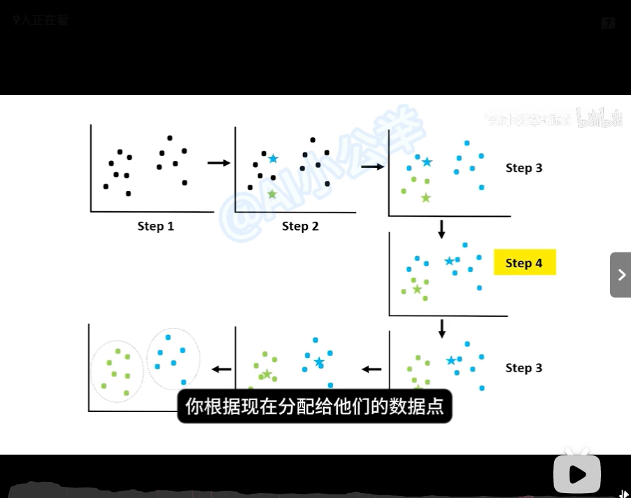

> 壁纸来源：[哲风壁纸](https://haowallpaper.com/homeViewLook/c8fa4d64c24abdccf1f524ae92044742)

<iframe width="100%" height="468" src="//player.bilibili.com/player.html?bvid=BV1BoNvzfELN" scrolling="no" border="0" frameborder="no" framespacing="0" allowfullscreen="true"> </iframe>

# 聚类分析

## 例子(10层电梯)
### 两类(高层响应/低层响应)
|读取数据(外呼输入)|K值|K均值分类|
|:---:|:---:|:---:|
|1,2,4,5|3|3|
|1|3|

